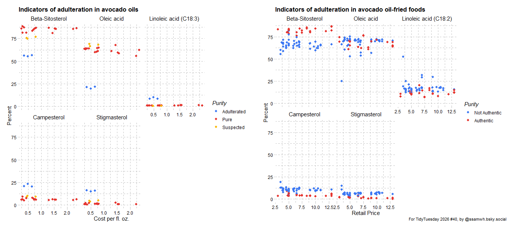

# TidyTuesday 2026 #40: Avocado Oil Authenticity

Original data [here](https://github.com/rfordatascience/tidytuesday/blob/main/data/2026/2026-10-06/readme.md).

Code for a plot of markers for avocado oil authenticity. This was my first time using the paletteer package, as well as my first time using cowplot to make two plots into one. As a biologist, I am interested in the two different linolenic acids - does some kind of conversion between the two happen in the cooking process? 

